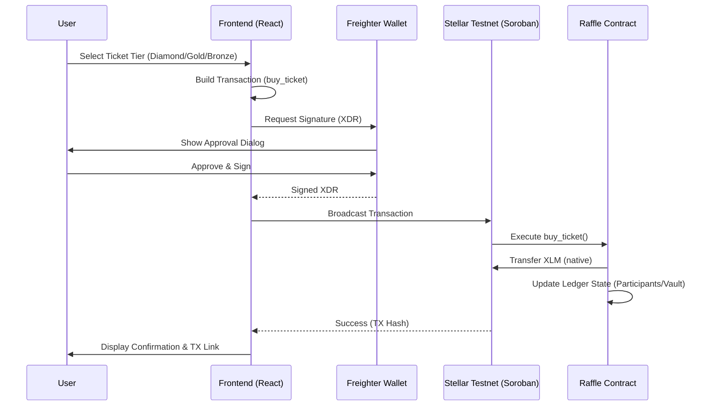

# StellarRaffle Pro — Architecture Document

> **Version:** 1.0 | **Network:** Stellar Testnet | **SDK:** Soroban SDK v22

This document provides a complete technical specification of the StellarRaffle Pro platform — covering smart contract design, data structures, financial logic, security considerations, and frontend integration patterns.

---

## Table of Contents

1. [System Overview](#1-system-overview)
2. [Smart Contract Design](#2-smart-contract-design)
3. [Data Structures & Storage](#3-data-structures--storage)
4. [Financial Logic & Fee Model](#4-financial-logic--fee-model)
5. [Ticket Tier System](#5-ticket-tier-system)
6. [Referral Engine](#6-referral-engine)
7. [Winner Selection & PRNG](#7-winner-selection--prng)
8. [Security Model](#8-security-model)
9. [Frontend Architecture](#9-frontend-architecture)
10. [Data Flow Diagrams](#10-data-flow-diagrams)

---

## 1. System Overview

StellarRaffle Pro is a fully on-chain lottery built on **Stellar's Soroban** smart contract platform. All financial logic — fee routing, prize distribution, referral payments, and winner selection — is executed deterministically inside the contract, with no off-chain oracle or server required.

```
┌─────────────────────────────────────────────────┐
│                   USER BROWSER                  │
│   React + Vite  ──  Freighter Wallet (Signer)   │
└────────────────────┬────────────────────────────┘
                     │  XDR Transactions
                     ▼
┌─────────────────────────────────────────────────┐
│          STELLAR TESTNET (Soroban RPC)           │
│  ┌────────────────────────────────────────────┐ │
│  │     ProfessionalRaffle Contract (Rust)     │ │
│  │  ┌──────────┐  ┌──────────┐  ┌─────────┐  │ │
│  │  │buy_ticket│  │draw_winner│  │withdraw │  │ │
│  │  └──────────┘  └──────────┘  └─────────┘  │ │
│  └────────────────────────────────────────────┘ │
│  ┌──────────────────────────────────────────┐   │
│  │   XLM Token Contract (Native SAC)        │   │
│  └──────────────────────────────────────────┘   │
└─────────────────────────────────────────────────┘

### System Components Sequence (Mermaid)


```

---

## 2. Smart Contract Design

The contract (`ProfessionalRaffle`) is implemented in **Rust** using the **Soroban SDK v22**. It exposes 5 public entry points:

| Function | Auth Required | Description |
|---|---|---|
| `initialize` | None | One-time setup: sets owner, token, deadline |
| `buy_ticket` | `buyer.require_auth()` | Purchase entry with tier + optional referrer |
| `draw_winner` | None (permissionless) | Select winner after deadline; auto-reset |
| `withdraw_fees` | `owner.require_auth()` | Owner withdraws accumulated vault balance |
| `get_raffle_info` | None (read-only) | Returns pool, ticket count, deadline, vault |
| `get_winner_history` | None (read-only) | Returns last 10 `WinnerRecord` entries |

### Storage Strategy

All state is held in **instance storage** (`env.storage().instance()`). This is appropriate because all keys are "hot" — read on nearly every transaction:

- `Owner`, `Token`, `Deadline` — set once on init, read on every call
- `Participants` — mutated on every `buy_ticket`
- `VaultBalance` — mutated on every `buy_ticket` and `withdraw_fees`
- `History` — mutated on every `draw_winner`

---

## 3. Data Structures & Storage

### `TicketTier` Enum
```rust
#[contracttype]
pub enum TicketTier {
    Bronze,   // 5 XLM  — 1 entry
    Gold,     // 20 XLM — 5 entries
    Diamond,  // 50 XLM — 15 entries
}
```

### `WinnerRecord` Struct
```rust
#[contracttype]
pub struct WinnerRecord {
    pub winner:    Address,  // Winner's Stellar address
    pub amount:    i128,     // Prize in stroops (1 XLM = 10,000,000 stroops)
    pub timestamp: u64,      // Ledger close time (Unix seconds)
}
```

### `DataKey` Enum (Storage Keys)
```rust
#[contracttype]
pub enum DataKey {
    Deadline,          // u64 — Unix timestamp for draw eligibility
    Participants,      // Vec<Address> — weighted list (duplication = more entries)
    Token,             // Address — XLM SAC contract address
    Owner,             // Address — fee recipient / admin
    VaultBalance,      // i128 — accumulated platform fees (stroops)
    History,           // Vec<WinnerRecord> — last 10 winners
    Referral(Address), // Reserved for future per-user referral stats
}
```

---

## 4. Financial Logic & Fee Model

Every `buy_ticket` call executes the following atomic fee distribution:

```
Ticket Price (P)
  ├── Referral Reward (1% of P)  ─────► Referrer Address (if provided)
  ├── Platform Fee (5% of P - referral) ► VaultBalance (owner-controlled)
  └── Net Price (P - referral)   ─────► Contract Address (prize pool)
```

### Example: Diamond Tier (50 XLM) with Referral

| Item | Calculation | Amount |
|------|-------------|--------|
| Ticket Price | 50 XLM | 50,000,000 stroops |
| Referral (1%) | 50 × 0.01 | 500,000 stroops |
| Platform fee | (50 × 0.05) − 0.5 | 2,000,000 stroops |
| Net to Pool | 50 − 0.5 | 49,500,000 stroops |

**Constants:**
```rust
const PLATFORM_FEE_BPS: i128 = 500; // 5.00% in basis points
```

---

## 5. Ticket Tier System

Tiers drive **entry weighting** — a participant's on-chain probability scales with their tier:

| Tier | Price | Entries in `Vec<Address>` | Probability (solo) |
|------|-------|--------------------------|-------------------|
| Bronze | 5 XLM | 1 | 1× |
| Gold | 20 XLM | 5 | 5× |
| Diamond | 50 XLM | 15 | 15× |

Winner selection iterates the `Participants` `Vec<Address>` where a user's address may appear multiple times. A random index is drawn — a Diamond buyer is 15× more likely to win than a Bronze buyer, reflecting their 10× price investment with a performance bonus.

---

## 6. Referral Engine

The referral system is fully **autonomous and trustless**:

1. Frontend detects `?ref=<STELLAR_ADDRESS>` in the URL
2. Referrer address is passed as `Option<Address>` to `buy_ticket`
3. Contract validates `ref_addr != buyer` to prevent self-referral abuse
4. If valid, 1% of ticket price is transferred to referrer **before** the buyer's net amount is sent to the contract

```rust
if let Some(ref_addr) = referrer {
    if ref_addr != buyer {
        referral_reward = price / 100;  // 1%
        platform_fee -= referral_reward; // adjust platform fee
        token_client.transfer(&buyer, &ref_addr, &referral_reward);
    }
}
```

This creates a viral incentive: every user benefits from sharing their referral link, with no platform overhead.

---

## 7. Winner Selection & PRNG

Soroban's native `env.prng()` is used for randomness:

```rust
let winner_idx = env.prng().gen_range::<u64>(0..count as u64) as u32;
let winner = participants.get(winner_idx).unwrap();
```

**Why Soroban PRNG?**
- Seeded from ledger-level entropy — not manipulable by the invoker
- Does not require an off-chain VRF oracle
- Deterministic replay: every validator independently computes the same winner

**Prize Distribution:**
```rust
let total_bal  = token_client.balance(&env.current_contract_address());
let vault_bal  = env.storage().instance().get(&DataKey::VaultBalance).unwrap();
let prize_pool = total_bal - vault_bal;  // Vault funds are excluded
token_client.transfer(&env.current_contract_address(), &winner, &prize_pool);
```

**Auto-Reset:** After each draw, `Participants` is cleared and `Deadline` advances by 3600 seconds (1 hour), enabling continuous lottery operation without redeployment.

---

## 8. Security Model

| Threat | Mitigation |
|--------|-----------|
| Unauthorized ticket purchase | `buyer.require_auth()` — Freighter signature required |
| Unauthorized fee withdrawal | `owner.require_auth()` — only deployed admin can drain vault |
| Self-referral exploit | `if ref_addr != buyer` guard in contract |
| Prize pool contamination | `VaultBalance` is tracked separately; subtracted before payout |
| Re-initialization attack | `if env.storage().instance().has(&DataKey::Owner) { panic! }` |
| Premature draw | `if env.ledger().timestamp() < deadline { panic! }` |
| Empty pool draw | `if count == 0 { panic!("No valid tickets sold.") }` |

---

## 9. Frontend Architecture

The frontend is a **React 19 + Vite 8** single-page application structured as follows:

```
src/
├── App.jsx               ← Root: tab state, alert system, global refresh
├── components/
│   ├── Wallet.jsx        ← Freighter connection; exposes pubKey to App
│   ├── Balance.jsx       ← Polls XLM balance via Horizon REST API
│   ├── RaffleInfo.jsx    ← Reads contract state (pool, tickets, deadline)
│   ├── BuyTicket.jsx     ← Builds & submits XDR transaction via Stellar SDK
│   ├── TierSelector.jsx  ← Stateless tier picker (Bronze/Gold/Diamond)
│   └── WinnerHistory.jsx ← Displays on-chain WinnerRecord list
├── App.css               ← Component-scoped styles
└── index.css             ← Global design tokens (glassmorphism, animations)
```

### Key Integration Pattern (`BuyTicket.jsx`)
1. Build a Stellar `Transaction` calling `buy_ticket` on the contract
2. Convert to XDR via `TransactionBuilder`
3. Submit XDR to Freighter: `signTransaction(xdr, { network: 'TESTNET' })`
4. Broadcast signed XDR via Horizon or Soroban RPC `sendTransaction`

---

## 10. Data Flow Diagrams

### Ticket Purchase Flow
```
User clicks "Buy Ticket"
      │
      ▼
BuyTicket.jsx builds XDR
      │
      ▼
Freighter signs (user approves)
      │
      ▼
Stellar RPC broadcasts transaction
      │
      ▼
Contract: buy_ticket() executes
   ├── Transfers referral reward → referrer
   ├── Updates VaultBalance
   └── Appends address(es) to Participants Vec
      │
      ▼
Frontend: refreshTrigger++ → RaffleInfo refetches
```

### Draw & Reset Flow
```
Deadline passes (ledger timestamp ≥ deadline)
      │
      ▼
Any user calls draw_winner()
      │
      ▼
Contract: env.prng().gen_range(0..count)
      │
      ▼
winner = Participants[random_index]
      │
      ▼
prize_pool = contract_balance - vault_balance
      │
      ▼
Transfer prize_pool → winner
      │
      ▼
Append WinnerRecord to History (keep last 10)
      │
      ▼
Reset: Participants = [], Deadline += 3600s
```

---

## Proficiency Demonstrated

| Skill Area | Implementation |
|---|---|
| Advanced Rust | `#[contracttype]`, generics, Option handling, match on enums |
| Soroban State Management | Instance storage, `DataKey` enum, Vec manipulation |
| Soroban Events | Ready for `env.events().publish()` extension |
| Financial Logic | Basis-point fee math, atomic multi-transfer in one invocation |
| Security Patterns | `require_auth`, guard clauses, re-initialization prevention |
| Frontend Web3 | Freighter signing, XDR construction, Horizon API polling |
| Testing | Full workflow test with mock ledger, token minting, auth bypass |

---

*StellarRaffle Pro — Level 5 Stellar Internship Architecture Document — 2026*
