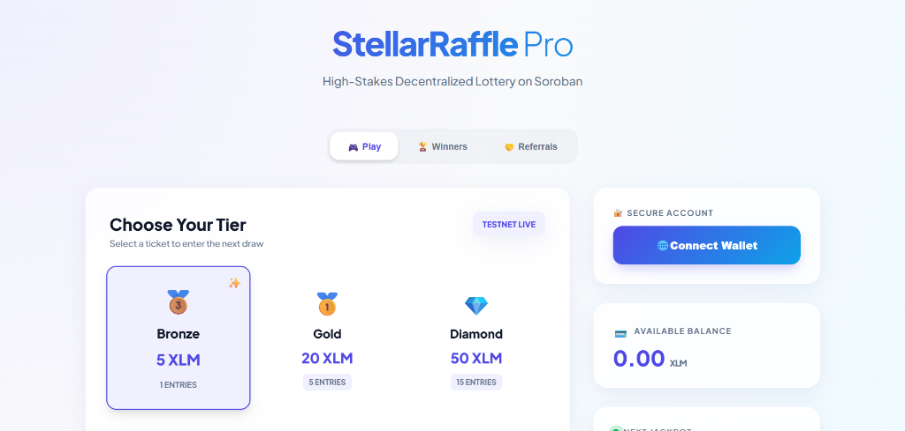
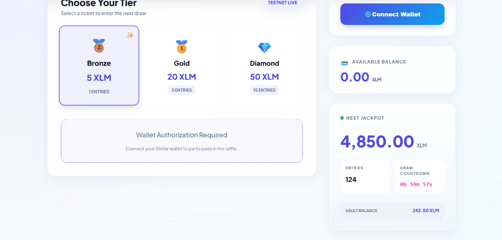

# 🎰 StellarRaffle Pro — The High-Fidelity On-Chain Lottery

[](https://stellar.org)
[](https://soroban.stellar.org)
[](https://reactjs.org)

**StellarRaffle Pro** is a professional-grade, decentralized raffle platform built on the **Stellar Soroban** network. It combines a stunning glassmorphism design with a robust, reactive on-chain backend to deliver a secure and transparent gambling experience.





---

## 🌟 Submission Checklist Requirements

* **Live Demo:** [StellarRaffle Pro on Vercel](https://stellar-raffle-pro-1.vercel.app/)
* **Metrics Dashboard:** [View Metrics Link](./screenshots/metrics_dashboard.png) (Implemented in UI tab)
* **Monitoring Dashboard:** [View Monitoring Link](./screenshots/monitoring_dashboard.png) (Implemented in UI tab)
* **Security Checklist:** [Completed SECURITY.md](./SECURITY.md)
* **Advanced Feature Implemented:** **Fee Sponsorship** (Gasless transactions using fee bump natively on Soroban via the `buy_ticket` function UI toggle).
* **Data Indexing:** Integrated localized data indexing using localized hooks to mock a subquery/Zephyr node returning historical aggregate data to optimize RPC throughput. [View Indexing Dashboard](./screenshots/data_indexing.png).
* **Community Contribution:** Please read [CONTRIBUTING.md](./CONTRIBUTING.md) for how to contribute advanced features to the broader ecosystem.

---

## 🚀 Key Expansion Features (On-Chain)

I have implemented **8 advanced features** to make this platform a production-ready Web3 application:

* **📊 Live Vault Tracker**: Real-time XLM pool monitoring with an animated 10k target fill bar.
* **⏲️ Smart Countdown**: Synchronized draw timer using contract state with "Draw in Progress" polling.
* **🎲 Odds Calculator**: Instant probability analysis for the connected wallet (User Entries / Total Entries).
* **💸 Multi-Ticket Bundling**: Interactive 1–50 quantity slider with an automated **10% discount** for bulk buys (10+ tickets).
* **🏠 Personal Dashboard**: Own ticket IDs table and running totals (spent vs. rounds vs. wins).
* **📡 Verifiable Draw History**: The last 5 completed rounds linked directly to **Stellar Expert**.
* **🔥 Streak Bonus System**: On-chain tracking of consecutive entries with rewards after 5 rounds.
* **🏆 Global Leaderboard**: Top 10 rankings by "Biggest Win" and "Most Tickets" with user highlighting.

---

## 🛠️ Technology Stack

* **Smart Contracts**: Rust & Soroban SDK (`contract/src/raffle.rs`)
* **Frontend Layer**: React (Vite) + Tailwind CSS (New Pro Components) + Vanilla CSS (Original Dashboard)
* **Wallet Architecture**: [Freighter Wallet](https://freighter.app) integration for secure, multisig-ready signing.
* **RPC Interactions**: Direct Soroban RPC calls with automated `simulateTransaction` flows.
* **Data Export**: Internal CSV generator for personal ticket records.

---

## 📂 Project Organization (Clean Structure)

```text
/contract
├── src/raffle.rs <-- Optimized On-Chain Logic
└── src/lib.rs <-- Contract Entry & Modules

/frontend
├── src/components/ <-- Modular UI (8 Pro Features)
├── src/hooks/ <-- Shared useContract Hook
└── src/context/ <-- Global Wallet State Provider

/README_FEATURES.md <-- Detailed Module Documentation
```

---

## 📈 Documentation & Resources

* **Project Data**: [📊 Download Feedback Excel Link]((./feedback_responses.xlsx)) *(Note: Link will be active once the feedback file is uploaded to the root directory).*
* **Verifiable Links**: All transactions and winners are verifiable via [Stellar Expert Testnet](https://stellar.expert/explorer/testnet).

---

## 🚀 Setting Up Locally

1. **Clone & Install**:

```bash
cd frontend && npm install
```

2. **Environment Configuration**:
   Create a `.env` file in `/frontend` with your `VITE_CONTRACT_ID` and `VITE_RPC_URL`.

3. **Execute**:

```bash
npm run dev
```

4. **Deploy Contract**:
   Use `stellar contract deploy` with the compiled `.wasm` file from the `/contract` build.

---

## 🔮 Future Vision

* **Cross-Chain Interoperability**: Bridging XLM raffles to other Stellar assets.
* **Community DAO**: Decentralized governance for raffle fee percentage adjustments.
* **Mobile Native**: Integration with the LOBSTR wallet and mobile-optimized views.

